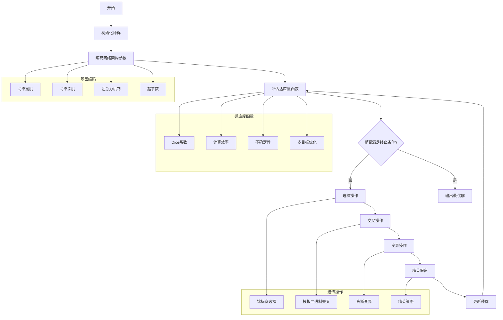

# 遗传算法优化流程图



## 遗传算法参数设置

| 参数 | 值 | 说明 |
|------|-----|------|
| 种群大小 | 50 | 平衡探索与收敛 |
| 最大代数 | 100 | 防止过拟合 |
| 交叉概率 | 0.8 | 保持多样性 |
| 变异概率 | 0.1 | 局部搜索 |
| 精英比例 | 0.2 | 保留优秀个体 |

## 适应度函数设计

```python
def fitness_function(individual):
    """多目标适应度函数."""
    # 主要目标：分割精度
    dice_score = evaluate_dice(individual)

    # 次要目标：计算效率
    efficiency = 1.0 / (flops + latency)

    # 第三目标：不确定性
    uncertainty = evaluate_uncertainty(individual)

    # 加权组合
    fitness = 0.6 * dice_score + 0.3 * efficiency + 0.1 * uncertainty

    return fitness
```
